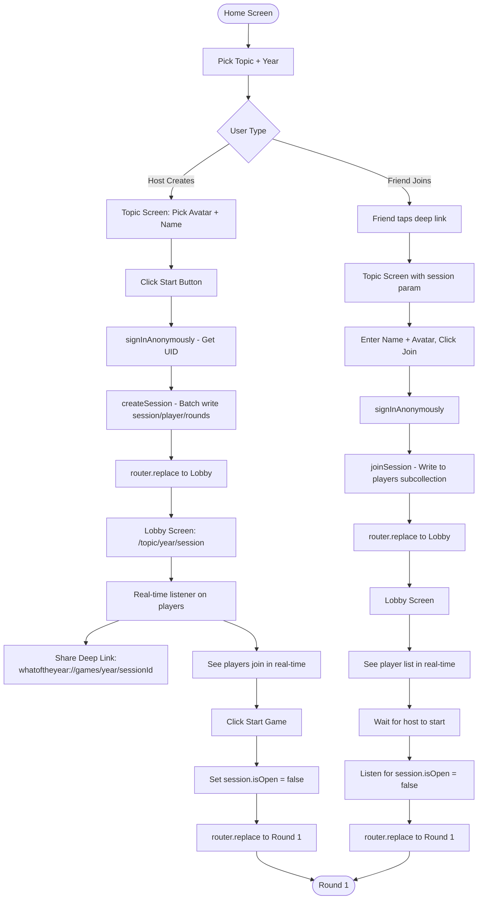

# Flow

```mermaid
flowchart TD
    Start([Home Screen]) --> PickTopic[Pick Topic + Year]
    PickTopic --> HostPath{User Type}

    %% Host Flow
    HostPath -->|Host Creates| TopicScreenHost[Topic Screen: Pick Avatar + Name]
    TopicScreenHost --> StartButton[Click Start Button]
    StartButton --> SignInHost[signInAnonymously - Get UID]
    SignInHost --> CreateSession[createSession - Batch write session/player/rounds]
    CreateSession --> NavLobbyHost[router.replace to Lobby]
    NavLobbyHost --> LobbyHost[Lobby Screen: /topic/year/session]

    LobbyHost --> HostActions[Real-time listener on players]
    HostActions --> ShareLink[Share Deep Link:<br/>whatoftheyear://games/year/sessionId]
    HostActions --> WaitPlayers[See players join in real-time]
    WaitPlayers --> StartGame[Click Start Game]
    StartGame --> CloseSession[Set session.isOpen = false]
    CloseSession --> NavRound1Host[router.replace to Round 1]

    %% Friend Flow
    HostPath -->|Friend Joins| DeepLink[Friend taps deep link]
    DeepLink --> TopicScreenFriend[Topic Screen with session param]
    TopicScreenFriend --> JoinButton[Enter Name + Avatar, Click Join]
    JoinButton --> SignInFriend[signInAnonymously]
    SignInFriend --> JoinSession[joinSession - Write to players subcollection]
    JoinSession --> NavLobbyFriend[router.replace to Lobby]
    NavLobbyFriend --> LobbyFriend[Lobby Screen]

    LobbyFriend --> FriendWait[See player list in real-time]
    FriendWait --> WaitHost[Wait for host to start]
    WaitHost --> ListenClose[Listen for session.isOpen = false]
    ListenClose --> NavRound1Friend[router.replace to Round 1]

    NavRound1Host --> Round1([Round 1])
    NavRound1Friend --> Round1
```
